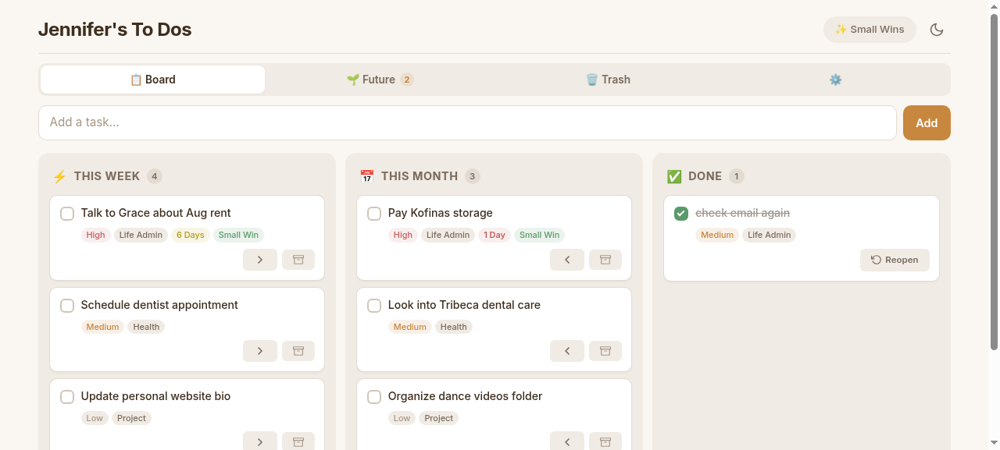

# Todo Now

A warm, cozy, mobile-friendly todo app built as a React PWA. Designed to reduce decision load by surfacing small, actionable tasks and organizing work by time horizon.



## Features

- **Three-column board**: This Week → This Month → Done, with drag-and-drop
- **Future tab**: Park tasks you're not ready for yet
- **Shopping list**: Lightweight checklist with archive support (pastel purple theme)
- **Grocery list**: Lightweight checklist for groceries (pastel green theme)
- **Sidebar drawer**: Todo Archive, Shopping Archive, and Settings in a slide-out menu
- **Small Wins filter**: Surface only low-effort, low-decision tasks
- **Inline tag editing**: Tap priority, area, effort, or decision load to change it
- **Due date urgency**: Color-coded countdown (red → orange → yellow → green), shown first on every card
- **Tappable due date**: Tap to open a calendar modal and change or set the date
- **Settings**: Toggle which labels appear on cards
- **Trash**: Soft delete with 30-day auto-purge and restore
- **Dark mode**: Warm cream (light) / deep cocoa (dark) theme
- **Mobile-first**: Horizontal-scroll board on small screens

## Architecture

```
todo-now/
├── server.ts          # Hono API server (Bun runtime)
├── index.tsx          # Server entry point
├── index.html         # SPA shell
├── vite.config.ts     # Vite build config
├── src/
│   ├── main.tsx       # React entry
│   ├── App.tsx        # Router (react-router-dom)
│   ├── styles.scss    # Global theme (CSS custom properties)
│   ├── pages/
│   │   ├── TodoPage.tsx    # Main board UI + all components
│   │   └── TodoPage.scss   # Page-specific styles
│   └── components/
│       └── theme-provider.tsx  # Light/dark mode context
├── data/
│   ├── tasks.json     # Task storage (gitignored)
│   ├── shopping.json  # Shopping list (gitignored)
│   └── groceries.json # Grocery list (gitignored)
└── public/
    └── favicon.svg
```

### Stack

- **Runtime**: [Bun](https://bun.sh)
- **Server**: [Hono](https://hono.dev) (API routes + static serving)
- **Frontend**: React 19 + react-router-dom
- **Styling**: SASS with CSS custom properties (no Tailwind)
- **Drag & drop**: [@dnd-kit/core](https://dndkit.com)
- **Build**: [Vite](https://vite.dev)
- **Storage**: JSON file on disk (`data/tasks.json`)

### API

| Method | Endpoint | Description |
|--------|----------|-------------|
| GET | `/api/tasks` | List all tasks |
| POST | `/api/tasks` | Create a task |
| PUT | `/api/tasks/:id` | Update a task |
| DELETE | `/api/tasks/:id` | Soft-delete (or `?permanent=true` to hard-delete) |
| GET | `/api/shopping` | List all shopping items |
| POST | `/api/shopping` | Create a shopping item |
| PUT | `/api/shopping/:id` | Update a shopping item |
| DELETE | `/api/shopping/:id` | Delete a shopping item |
| GET | `/api/groceries` | List all grocery items |
| POST | `/api/groceries` | Create a grocery item |
| PUT | `/api/groceries/:id` | Update a grocery item |
| DELETE | `/api/groceries/:id` | Delete a grocery item |

### Task Model

```typescript
{
  id: string;
  title: string;
  done: boolean;
  status: "this-week" | "this-month" | "future" | "done" | "trashed";
  priority: "high" | "medium" | "low";
  effort: "low" | "medium" | "high";
  decisionLoad: "low" | "medium" | "high";
  area: string;
  dueDate: string | null;
  isSmallWin: boolean;  // auto-inferred from effort + decisionLoad
  createdAt: string;
  completedAt: string | null;
  deletedAt: string | null;
}
```

### Small Win Logic

A task qualifies as a "small win" when:
- Effort is **not** high
- Decision load is **low**

This filters out tasks likely to trigger research spirals or extended comparison.

## Development

```bash
bun install
bun run dev
```

## Hosting

Currently hosted on [Zo Computer](https://zo.computer) as a Zo Site.

## License

MIT
