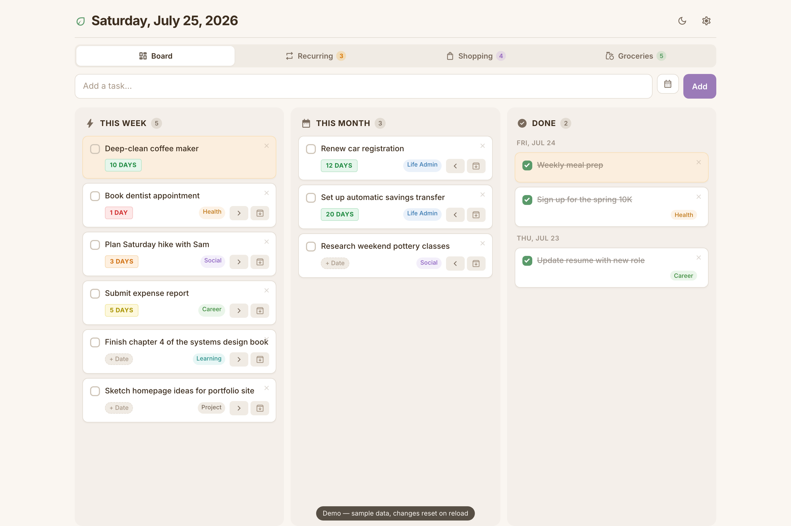
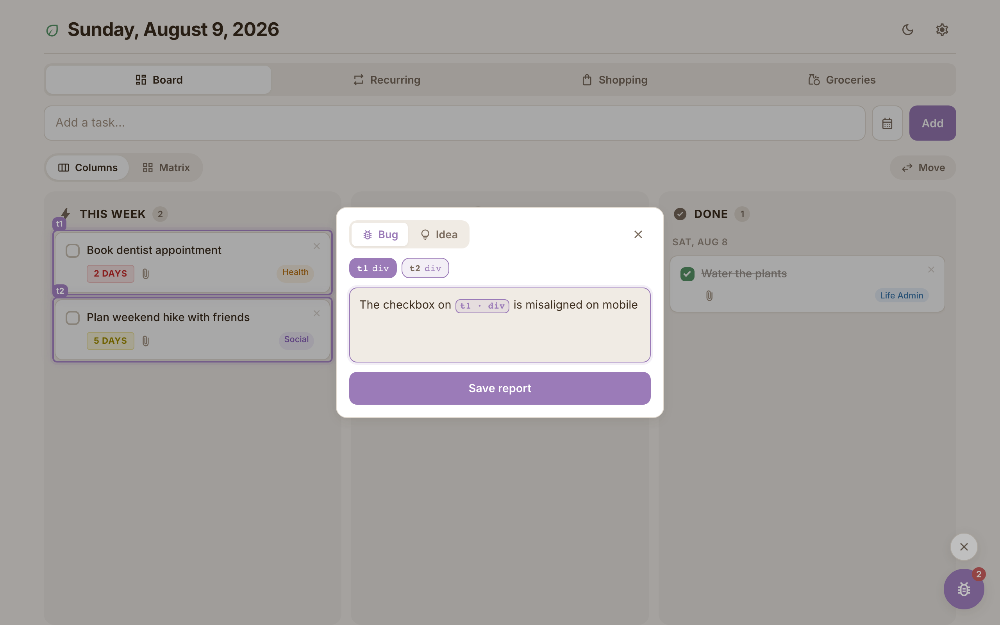

# Todo Now

A warm, cozy, mobile-friendly todo app built as a React PWA. Designed to reduce decision load by surfacing small, actionable tasks and organizing work by time horizon.

[](https://j-alicia-long.github.io/todo-now/)

**▶ Try the live demo:** [j-alicia-long.github.io/todo-now](https://j-alicia-long.github.io/todo-now/) — static build seeded with sample data (in-memory, changes reset on reload).

## Features

- **Task board**: organize tasks by time horizon — This Week → This Month → Done — with drag-and-drop, a Future tab for parking ideas, and inline editing of due dates and labels right on each card
- **Recurring tasks**: weekly habits and long-term chores that resurface on the board when due
- **Shopping & grocery lists**: lightweight checklists, each with its own pastel theme
- **Desktop & mobile**: responsive PWA — full web app on desktop, installable touch-first app on phones
- **Theming**: warm cream (light) / deep cocoa (dark) themes
- **Bug Reporter**: shake (mobile) or ⌘⇧P (desktop) opens Report Mode — tap elements to highlight them, then file a bug or idea, saved as Markdown for an agent to pick up later

  

## Architecture

Layered React SPA over a thin Hono API: Controller (`src/tabs/todo-base.tsx`) → Tabs → Components → Stores (client data layer with a swappable transport seam) → shared pure Domain rules → generic Server resource modules → JSON files on disk. Full layer-by-layer breakdown, module map, and API table: [docs/ARCHITECTURE.md](docs/ARCHITECTURE.md).

### Stack

- **Runtime**: [Bun](https://bun.sh)
- **Server**: [Hono](https://hono.dev) (API routes + static serving)
- **Frontend**: React 19 + react-router-dom
- **Styling**: SASS with CSS custom properties (no Tailwind)
- **Drag & drop**: [@dnd-kit/core](https://dndkit.com)
- **Build**: [Vite](https://vite.dev)
- **Storage**: JSON files on disk — `DATA_DIR` env var if set, else `/home/workspace/todo-data/` when present (Zo production, outside the synced tree), else `./data/` (local dev)

### API

Generic CRUD routes per list family (`/api/tasks`, `/api/shopping`, `/api/groceries`, `/api/recurring`), plus `/api/settings` (get/update), write-only `/api/reports` (bug Reporter), and `/api/archive` (weekly archive sweep). Full route table in [docs/ARCHITECTURE.md](docs/ARCHITECTURE.md#api).

### Task Model

```typescript
{
  id: string;
  title: string;
  done: boolean;
  status: "this-week" | "this-month" | "future" | "done" | "trashed";
  effort: "low" | "medium" | "high";
  decisionLoad: "low" | "medium" | "high";
  area: string;
  dueDate: string | null;
  importance: "important" | "not-important" | null; // null = Unsorted on the Matrix
  createdAt: string;
  completedAt: string | null;
  deletedAt: string | null;
  source: "board" | "shopping" | "grocery";
  sourceItemId: string | null;
}
```

Urgency is never stored — a Task is urgent iff its due date is within 2 days or overdue (ADR 0001, `docs/adr/`).

## Development

```bash
bun install
bun run dev
```

If `bun run dev` fails with "port in use", a stale dev server is still holding the port (`local_port` in `zosite.json`). Find and kill it:

```bash
lsof -i :57460 -P -n   # find the PID holding the port
kill <PID>
```

## Hosting

Currently hosted on [Zo Computer](https://zo.computer) as a Zo Site.

### Demo build

A serverless demo lives at [j-alicia-long.github.io/todo-now](https://j-alicia-long.github.io/todo-now/), deployed by `.github/workflows/deploy-demo.yml` on every push to `main`. Building with `VITE_DEMO=true` swaps the HTTP transport for an in-memory one (`src/stores/demo-transport.ts`) that reuses the server's family logic and seeds sample data (`src/stores/demo-data.ts`) — no API server needed.

```bash
VITE_DEMO=true bunx vite build --base=/todo-now/ --outDir dist-demo
```

## License

MIT
